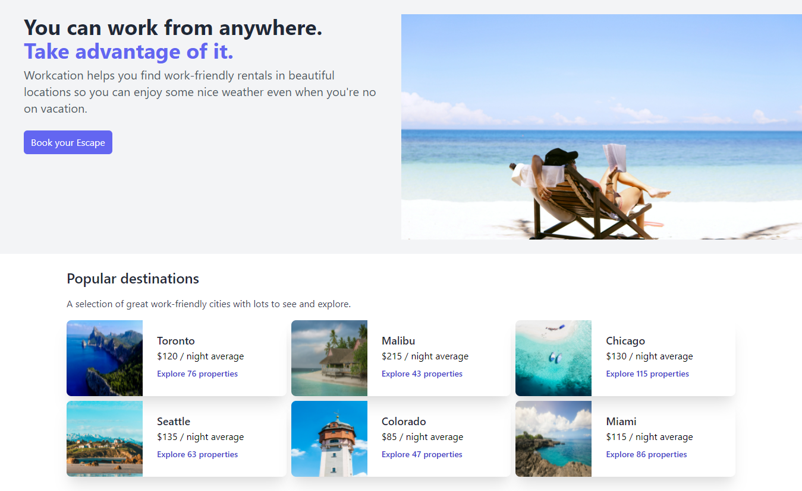

# TailwindCSS Tutorial

## OBJECTIVE: 
Reproduce the **TAILWIND LABS** Workcation page.

### TECH STACK USED
+ **npm** - The live server and installing *tailwindcss, autoprefixer & postcss*.
+ **HTML5** - Markup the content to be displayed on the page.
+ **Tailwind css** - Style the marked up content.

## RESULT

###Features To-Do List
- [ ] Write the site in React.
- [ ] Add responsiveness for various screen sizes.
- [ ] Add state change code e.g. *active, hover, focus*.
- [ ] Purge Stylesheet to only used styles.
- [ ] Extend Tailwind to use custom colors.
- [x] Use Tailwind CSS to style the components. 
- [x] Find some quality photos for use.
- [x] Reproduce the HTML content.  
