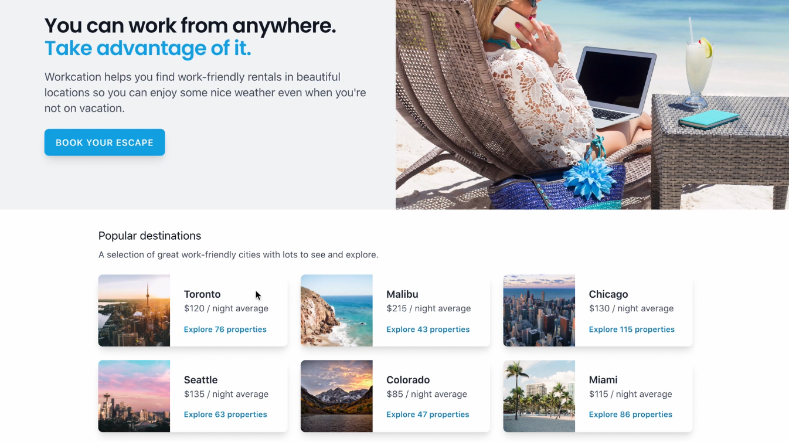

# TailwindCSS Tutorial

## OBJECTIVE: 
Reproduce the **TAILWIND LABS** Workcation page.

### TECH STACK USED
+ **npm** - The live server and installing *tailwindcss, autoprefixer & postcss*.
+ **HTML5** - Markup the content to be displayed on the page.
+ **Tailwind css** - Style the marked up content.